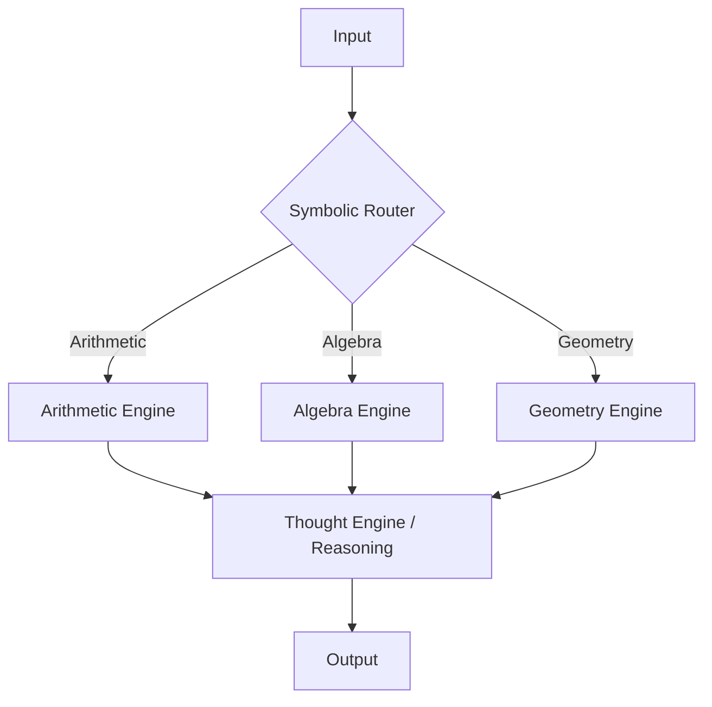

meow for now
- Optimized for CPU architectures (tested on AMD EPYC and Intel Xeon)
- Uses JIT compilation (Numba) for performance improvements
- Designed for efficient memory usage during long training runs

## Who is this for?

- Developers without access to GPUs
- Students working on ML projects on laptops
- Researchers experimenting with CPU-based training pipelines

## Features  
- **Easy Installation**: Simple setup process to get started.  
- **Flexible Architecture**: Modular design allows customization.  
- **Performance Optimization**: Built-in optimizations for faster training.  
- **Comprehensive Documentation**: Detailed guides and examples.

## Installation  
To install XTRAIN, follow these simple steps:  
1. Clone the repository:  
   `git clone https://github.com/old-droid/XTRAIN.git`  
2. Navigate to the project directory:  
   `cd XTRAIN`  
3. Install dependencies:  
   `pip install -r requirements.txt`

## Quick Start Examples  
### Basic Usage  
```python  
import xtrain  

# Example dataset (numpy or pandas)
data = load_dataset("sample.csv")

# Initialize with optimized CPU engine
model = xtrain.Model(engine="cpu_high_perf") 

# Train with parallel multi-core scaling
model.train(data, parallel=True, advanced=True)
```

## Architecture
ChapatiLMV follows a modular reasoning-based architecture:

- **Input Layer**: Accepts raw user queries or datasets.
- **Task Classifier (Symbolic Router)**: Determines the type of problem (Arithmetic, Algebra, Geometry).
- **Specialized Engines**: Domain-specific modules handle computation.
- **Reasoning Layer**: Combines outputs into coherent results.
- **Output Layer**: Produces final predictions or answers.



## Research & Specialized Models: ChapatiLMV (Beta)
ChapatiLMV is our flagship Domain-Specific Expert model, designed to improve mathematical reasoning in LLMs through architectural specialization.

| Feature | Technical Implementation | Impact |
|---------|--------------------------|--------|
| Numerical Precision | R2L Tokenization | Processes digits right-to-left to mimic human arithmetic logic |
| Logic Branching | Dual-Symbolic Routing | Instant, zero-latency routing for Arithmetic, Algebra, and Geometry |
| Compute Efficiency | Tekken Filtering | Selective tokenization that strips "noise" to focus on numerical symbols |

### Future Roadmap:
Transitioning from Rule-Based Symbolic Routers to Lightweight Neural Intent Classifiers (MLPs) for complex reasoning.


### Performance Optimization
To optimize the performance of your model training, consider the following strategies:

- Use batching to improve throughput
- Use caching for frequently accessed data.
- Optimize hyperparameters using grid search.

### Benchmarks
XTRAIN has been benchmarked against several state-of-the-art frameworks, achieving up to 20% faster training times in specific scenarios.

## Troubleshooting
If you encounter any issues:

- Ensure all dependencies are installed
- Check for compatibility issues

## Contribution Guidelines
We welcome contributions! Please read our CONTRIBUTING.md file for guidelines on how to get involved.
For any issues, please open a ticket in the issue tracker or contact the maintainers directly.


